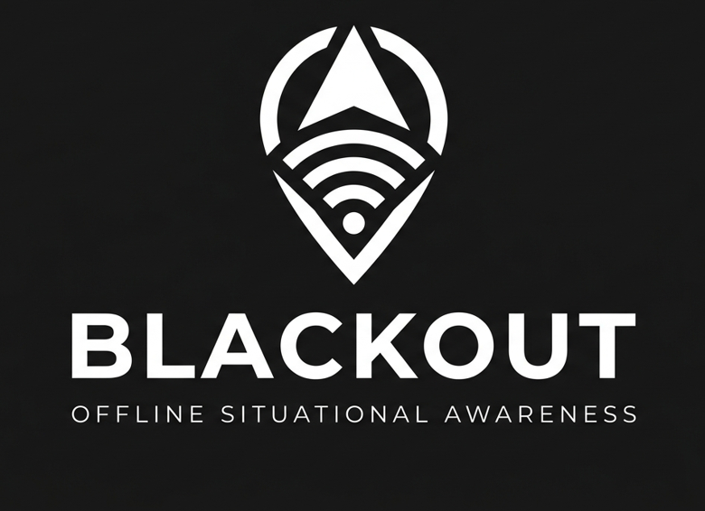
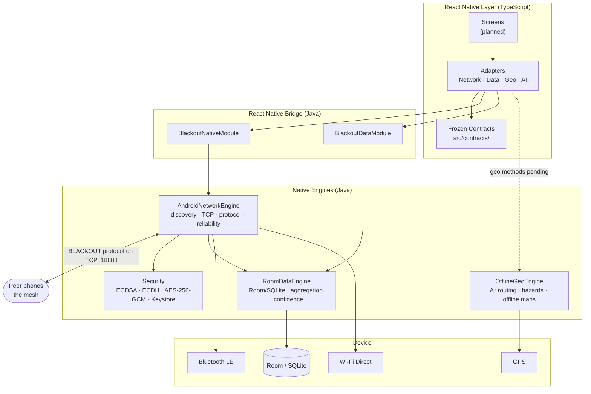
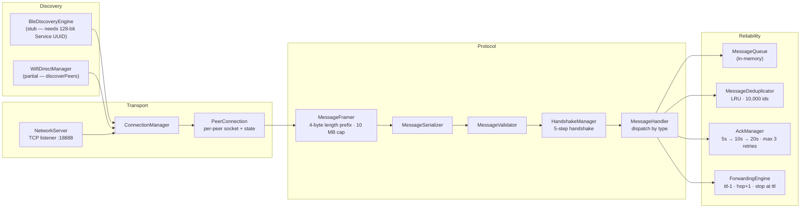
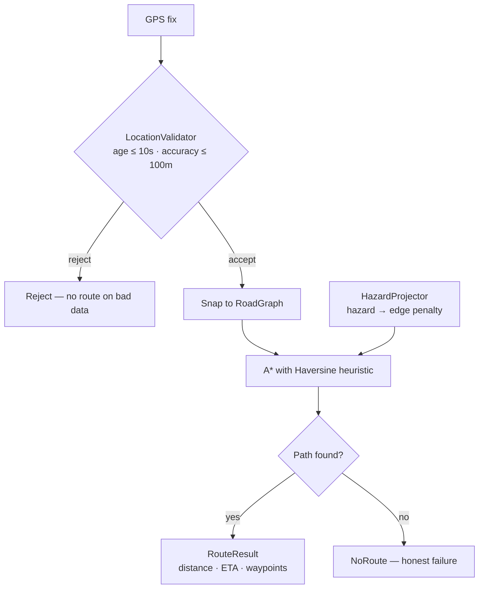
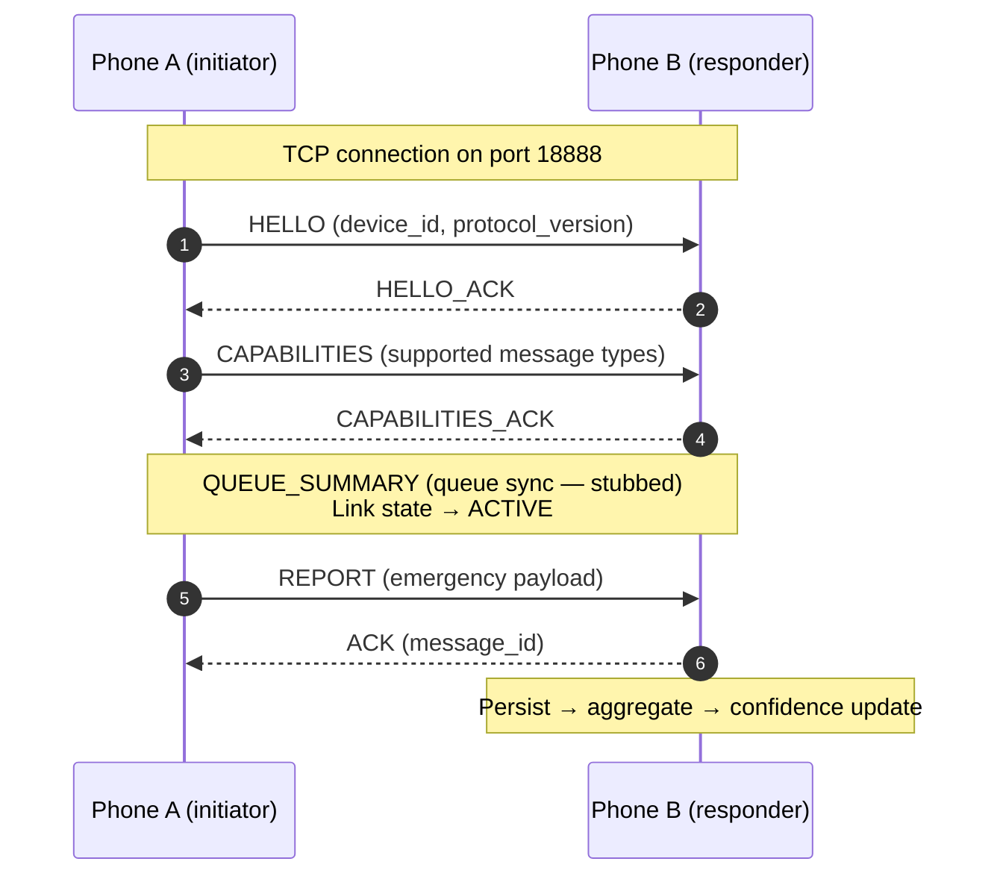
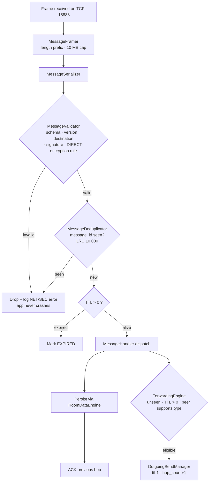
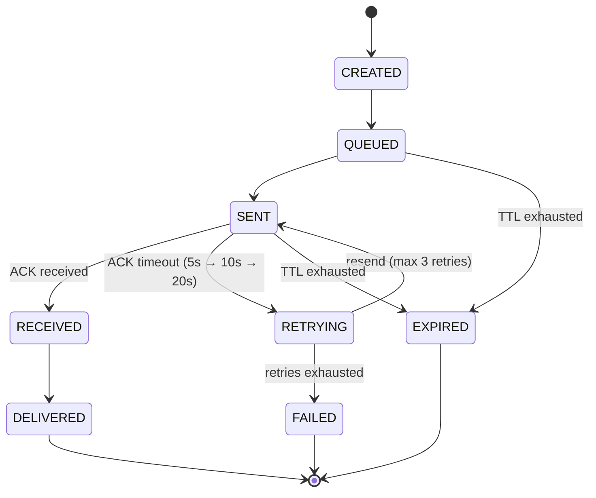

<div align="center">



### *When the network dies, the people become the network.*

**BLACKOUT is an offline-first, decentralized emergency-communication mesh for Android.**
No towers. No servers. No internet. Just phones, talking directly to each other —
discovering, relaying, and verifying life-saving information when everything else has gone dark.


> [!IMPORTANT]
> **Work in progress.** This repository is a team prototype under active construction.
> The protocol, network engine, data engine, and geo engine are implemented and unit-tested;
> hardware discovery layers, UI screens, and full multi-device field validation are still in progress.
> See [Current Status](#current-status) for the honest, itemized picture.

</div>

---

## Table of Contents

- [The Problem](#-the-problem)
- [The Solution](#-the-solution)
- [Why BLACKOUT Is Different](#-why-blackout-is-different)
- [Unique Selling Points](#-unique-selling-points)
- [System Architecture](#-system-architecture)
- [Engine Deep Dives](#-engine-deep-dives)
  - [Network Engine — the mesh](#network-engine--the-mesh)
  - [Data Engine — the memory](#data-engine--the-memory)
  - [Intelligence Engine — the judgment](#intelligence-engine--the-judgment)
  - [Geo Engine — the way out](#geo-engine--the-way-out)
  - [Security Layer — the trust](#security-layer--the-trust)
- [The BLACKOUT Mesh Protocol](#-the-blackout-mesh-protocol)
- [Repository Structure](#-repository-structure)
- [Technology Stack](#-technology-stack)
- [Current Status](#-current-status)
- [Getting Started](#-getting-started)
- [Testing](#-testing)
- [Roadmap](#-roadmap)
- [Documentation Map](#-documentation-map)
- [Engineering Principles](#-engineering-principles)
- [Team & Module Ownership](#-team--module-ownership)

---

## The Problem

When a disaster strikes — an earthquake, a flood, a blackout, an attack — the modern
communication stack fails in predictable, compounding ways. BLACKOUT was designed
around five observed failure modes:

| # | Failure mode | What actually happens on the ground |
|---|--------------|--------------------------------------|
| **P-1** | **Infrastructure collapse** | Cell towers lose power or backhaul; the cellular network itself becomes the casualty. Every internet-dependent app dies with it. |
| **P-2** | **Cascading overload** | Surviving infrastructure is swamped. Calls fail, messages stall in "sending…", and the few working channels are unusable precisely when everyone needs them. |
| **P-3** | **Information vacuum → rumor** | With no trusted feed, fear fills the gap. Unverified claims ("the bridge is out", "hospital is closed") propagate at full speed with no way to weigh them. |
| **P-4** | **Coordination absence** | Responders, trapped people, and families have no shared, current picture of where help is needed and where danger has moved. |
| **P-5** | **Last-mile knowledge stays trapped** | The person who *knows* the road is blocked has no channel to the rescuer ten streets away. Critical knowledge dies in pockets. |

The uncomfortable truth these five rows share: **nearly every communication tool we
own assumes infrastructure that disasters take away first.** BLACKOUT removes that
assumption at the foundation instead of patching around it.

---

## The Solution

> **The network isn't something people connect to. The people *are* the network.**

BLACKOUT turns ordinary Android phones into the infrastructure:

- **Phones discover each other** over Bluetooth Low Energy and Wi-Fi Direct — no router, no hotspot, no cell tower.
- **Phones talk directly** over local TCP links using a purpose-built, self-contained wire protocol (the *BLACKOUT protocol*).
- **Phones relay for each other.** A message doesn't need a path to the destination right now — it hops opportunistically, is stored-and-forwarded, retried, and deduplicated, until it arrives. If one phone stands between you and help, that phone *is* the network for you.
- **Nothing is forgotten.** Every report, message, and hazard is persisted locally in an on-device SQLite database. Kill the app, restart the phone — the picture survives.
- **Information is judged, not just moved.** Reports are aggregated into incidents and scored by a deterministic confidence engine, so "5 independent witnesses" visibly outweighs "1 frightened rumor" — and contradictions are preserved, never silently erased.
- **Maps and routing work offline.** The geo engine routes around blocked roads and active hazards using bundled map data — no tile server, no download.
- **Privacy holds even on relays.** Private messages are end-to-end encrypted; intermediate phones forward ciphertext they cannot read.

In one sentence: **BLACKOUT is trustworthy situational awareness that works precisely
when nothing else does.**

---

## Why BLACKOUT Is Different

> This section deliberately stays at the *category* level rather than naming products —
> the point is the design space we occupy, not a head-to-head scoreboard.

Tools that address communication after disasters generally fall into three buckets,
and each has a structural gap:

1. **Mainstream messengers.** Excellent products — but internet-dependent by design.
   When towers and backhaul go down, they degrade gracefully into **nothing**. Their
   architecture assumes the very thing a disaster removes first.
2. **Proprietary radio / mesh hardware gadgets.** They genuinely work offline, but
   they are a *separate device*: extra cost, extra battery, extra thing to remember
   to charge, produced in numbers far smaller than the phones people already carry.
3. **Satellite messengers.** Real lifelines for individuals in the wilderness — but
   per-message economics, sky visibility requirements, and one-device-per-person
   limits make them a personal beacon, not a neighborhood mesh.

**BLACKOUT's bet:** the most abundant, most charged, most familiar communication
device in any disaster zone is already the smartphone. So we build the mesh in
software, on hardware people already own, for free — and we don't stop at moving
bytes. Routing, aggregation, and confidence scoring are treated as first-class
citizens, not afterthoughts.

| Mainstream apps optimize for… | BLACKOUT optimizes for… |
|---|---|
| Throughput, when connected | **Delivery, when disconnected** |
| One global truth (server) | **Eventual local consistency (mesh)** |
| Engagement | **Trustworthiness under uncertainty** |
| Cloud persistence | **Device survival of restarts & death** |
| Identity via accounts | **Identity via cryptography, no signup** |

---

## Unique Selling Points

1. **Infrastructure-free by design** — no towers, servers, SIMs, or internet. The mesh *is* the phones.
2. **Store-and-forward mesh relay** — messages outlive connectivity gaps; any phone can carry another's message toward its destination, with dedup, TTL, and ACKs.
3. **Deterministic intelligence layer** — overlapping reports merge into incidents and receive reproducible, auditable confidence scores. Same evidence → same score, every time.
4. **Cryptographic identity without accounts** — your `device_id` is derived from your public key. No phone number, no email, no signup, nothing for a compromised server to leak.
5. **Privacy-preserving relays** — DIRECT messages are end-to-end encrypted (ECDH + AES-256-GCM); relaying phones handle ciphertext only.
6. **Offline maps + hazard-aware routing** — turn-by-turn that reroutes around blocked roads and active hazards with zero connectivity.
7. **Built for the device people already own** — plain Android (API 24+). No dongles, no dedicated hardware, no per-message fees.
8. **Contradictions are first-class evidence** — a "the bridge is fine" report lowers confidence but is *never deleted or overwritten*; conflicting observations stay visible.
9. **Honest degradation** — BLE for discovery, Wi-Fi Direct for data, local TCP on links; when one transport fails, another carries the load.

---

## System Architecture

BLACKOUT is **contract-first**: every engine is defined as a frozen TypeScript
contract in `src/contracts/` before any native code is written. The UI talks only to
contracts through adapters; adapters talk to Java engines over the React Native
bridge. Nothing in the UI knows whether it's talking to a real radio or a test fake.

```
React Native UI (TypeScript)
        │
        ▼
   Contract Adapters            ←  src/adapters/  (TS, thin: convert + delegate)
        │
        ▼
  React Native Bridge           ←  com.blackout.bridge  (BlackoutNativeModule / BlackoutDataModule)
        │
        ▼
   Java Engines (Android)
   ┌──────────────┬──────────────┬──────────────┐
   │   Network    │     Data     │     Geo      │
   │   Engine     │    Engine    │   Engine     │
   └──────────────┴──────────────┴──────────────┘
        │                │               │
   BLE / Wi-Fi      Room / SQLite     OSM / GPS
   Direct / TCP                        MapLibre
```



**Why contract-first matters (and why you should never break it):**
- Four teammates build four engines in parallel without merge conflicts in logic —
  only the shared bridge file needs coordination (see *Engineering Principles*).
- Unit tests swap real engines for fakes at the contract boundary.
- The TypeScript contract is the single source of truth; Java implements, never redesigns.

---

## Engine Deep Dives

### Network Engine — the mesh

*Owner: Member 1 · Package `com.blackout.network` · Phases 1–6 implemented, 7–8 pending*

The network engine moves BLACKOUT protocol frames between phones. It is the only
engine that owns radios, sockets, and peer state.



- **Framing** — every message is a 4-byte big-endian length prefix + UTF-8 JSON body, capped at **10 MB**; oversized or malformed frames are dropped, never crash the app.
- **Handshake** — HELLO → HELLO_ACK → CAPABILITIES → CAPABILITIES_ACK → QUEUE_SUMMARY (sync stub). Links move `NEW → CONNECTING → HANDSHAKING → ACTIVE`, with a `FAILED` terminal state.
- **Reliability** — every sent message awaits an `ACK` with **5 s → 10 s → 20 s** backoff, max **3 retries**, then `FAILED`. Messages expire by TTL. Receivers deduplicate on `message_id` with a 10,000-entry LRU, so a flooded network can't turn one report into a thousand.
- **Store-and-forward** — if no route exists now, messages queue and retry as the mesh shifts. *(Queue persistence into Room is the Phase 4/8 target; the queue is currently in-memory.)*
- **Forwarding rule** — a peer forwards a message only if it has **not seen it before AND `TTL > 0` AND the peer supports that message type**. Each hop decrements TTL and increments `hop_count`.
- **Identity** — `DeviceIdentity` generates a stable per-device keypair on first launch and persists it in `SharedPreferences`; the public key bytes feed the cryptographic `device_id` (see Security).

### Data Engine — the memory

*Owner: Member 2 · Package `com.blackout.data` · Fully implemented incl. native bridge*

When the app's process dies, in-memory queues vanish. The data engine's job is that
**no life-saving information is ever lost with them.**

- **Room/SQLite** database (`blackout_database`, **version 2**) with 5 entities, 5 DAOs, 2 repositories, type converters, and explicit **MIGRATION_1_2** (`ALTER TABLE network_messages ADD COLUMN isRead`). *Never* a destructive fallback.
- **RoomDataEngine** is the single facade — the only class the bridge calls.
- The **golden rule**: a DTO is the application contract; a Room Entity is a persistence representation. Repositories convert between them — DAOs contain pure SQL, zero business logic.

| Entity | Purpose |
|---|---|
| `NetworkMessageEntity` | All mesh traffic, DIRECT + REPORT alike; carries encryption metadata; supports `isRead` (v2). |
| `EmergencyReportEntity` | Structured emergency observations: category, severity, location, verification state, reporter id. |
| `IncidentEntity` | An aggregated event — many reports collapse into one incident. |
| `EvidenceEntity` | Photos/attachments with content hashes, linked to reports & incidents. |
| `ResourceEntity` | Shelters, food/water, medical points, with availability & freshness. |

**DIRECT vs REPORT — the hard separation.** `MessageValidator` rejects any DIRECT
message lacking a destination and encryption metadata. DIRECT flows are private
messages; REPORT flows become incidents. They never share aggregation logic, and a
DIRECT message *never* creates an incident, confidence update, or report source.

### Intelligence Engine — the judgment

*Inside the data engine: `SpatialAggregator` + `ConfidenceCalculator`*

Two problems, two deterministic answers:

1. **50 people report the same bridge collapse** → the map must show *one* incident, not 50 pins.
2. **Is this report reliable?** → a score you can recompute and audit, not a vibe.

**Incident similarity** (canonical model from the master spec):

```
S = 0.35·S_geo + 0.20·S_time + 0.20·S_category + 0.15·S_text + 0.10·S_evidence
Merge a report into an existing incident only when S ≥ 0.70 (and categories are compatible).
Text similarity = Jaccard over normalized tokens (lowercase, Unicode-normalized,
punctuation stripped, fixed stop-word list). Initial geographic radius: 500 m.
```

> **Current MVP baseline:** the implemented `SpatialAggregator` uses a deliberately
> conservative merge rule — *same category + Haversine distance ≤ 50 m* — while the
> weighted multi-factor similarity above is the documented target model. Confidence
> scoring below is already implemented per spec.

**Confidence score** (deterministic, reproducible, rationale persisted):

```
independence    = min(independent_source_count / SOURCE_TARGET, 1)      SOURCE_TARGET = 3
corroboration   = min(max(independent_source_count - 1, 0) / 2, 1)
evidence        = min(supporting_evidence / 2, 1)
freshness       = max(0, 1 - age_ms / 24 h)
trusted_conf    = 1 if a trusted device confirmed, else 0
contradiction   = min(contradiction_count / 2, 1)

raw   = 0.35·independence + 0.25·evidence + 0.20·corroboration
      + 0.10·freshness    + 0.10·trusted_conf
final = clamp(0, 1, raw − 0.20·contradiction)
```

| Final score | Level |
|---|---|
| 0.00 – 0.24 | `UNVERIFIED` |
| 0.25 – 0.49 | `LIKELY` |
| 0.50 – 0.79 | `HIGH_CONFIDENCE` |
| 0.80 – 1.00 | `CONFIRMED` — **only** with trusted confirmation; otherwise capped at `HIGH_CONFIDENCE` |

Anti-rumor properties worth remembering:
- **Forwarded copies don't inflate confidence.** Three relays of one reporter's report = **one** independent source. Source counts derive from the original `reporter_device_id`.
- **Contradictions are preserved.** A "bridge is fine" report applies its penalty and stays on record — nothing is silently deleted or overwritten.
- **Same inputs → same score.** Determinism is a testable requirement, not a nicety.
- **Severity baselines** exist per category (e.g. TRAPPED_PERSON, FIRE, FLOOD → HIGH); explicit user-set higher severity is never silently lowered.

### Geo Engine — the way out

*Owner: Member 3 · Package `com.blackout.geolocation` · Fully implemented, standalone-tested*

An **offline A\* router** over OpenStreetMap road graphs, with hazard awareness.

- **Routing** — `AStarRouter` with a Haversine heuristic; the graph invariant `baseCost ≥ distanceM` keeps the heuristic admissible (never overestimates → optimal paths). Directed `GraphEdge`s; `getEffectiveCost() = baseCost + hazardPenalty` makes dangerous edges expensive instead of simply forbidden.
- **Hazards** — `HazardProjector` maps point hazards onto road segments with an equirectangular approximation (111,320 m per degree latitude) and penalizes or blocks affected edges. Expired hazards stop affecting routing automatically.
- **Location quality gate** — `LocationValidator` accepts GPS fixes at most **10 s** old with accuracy ≤ **100 m**; stale or fuzzy fixes are rejected rather than trusted.
- **Offline maps** — `OfflineMapManager` reads from `BundledMapSource` / `LocalMapCache`. It **never downloads**: no tile server is ever contacted.
- **Travel estimates** — `DEFAULT_AVERAGE_SPEED_MPS = 13.89` (≈ 50 km/h) for ETA arithmetic when no live speed exists.



### Security Layer — the trust

*Cross-cutting: `com.blackout.security` + protocol-level enforcement*

Security goals (from the master spec): offline trust, message integrity, DM
confidentiality, authenticity, replay protection, key safety, and **zero sensitive
data in logs**.

- **Identity** — `device_id = lowercase(hex(SHA-256(canonical public key bytes)))[:32]`. Your identity *is* your key; no accounts, no PII.
- **Integrity** — every envelope is signed: **ECDSA P-256 over SHA-256** of the canonical serialization. Tampered frames fail validation and are dropped with `SEC_*` error codes.
- **Confidentiality (DIRECT)** — **ephemeral ECDH P-256** between sender and recipient → **HKDF-SHA-256** key derivation → **AES-256-GCM** with 96-bit nonces. Relays forward ciphertext and cannot read it. `MessageValidator` *enforces* this: a DIRECT message without destination + encryption metadata is invalid.
- **Key custody** — private keys live in the **Android Keystore**, hardware-backed where available.
- **Trust model** — devices progress `UNKNOWN → SEEN → TRUSTED` or `→ BLOCKED`, entirely offline. Only trusted confirmation unlocks the `CONFIRMED` confidence level.
- **Logging rule** — never log payloads, plaintext, keys, or secrets. Debug logs identify messages by id and type only.

---

## The BLACKOUT Mesh Protocol

A self-contained JSON-over-TCP protocol. One envelope, twelve message types,
no external dependencies.

### Envelope

```json
{
  "protocol_version": 1,
  "message_id": "9f2c…e41a",
  "origin_device_id": "a1b2c3d4e5f60718293a4b5c6d7e8f90",
  "destination_device_id": "…or null for mesh-wide",
  "message_type": "REPORT",
  "created_at": 1759680000000,
  "ttl": 8,
  "hop_count": 0,
  "priority": "HIGH",
  "payload_hash": "sha256:…",
  "payload": { },
  "signature": "ECDSA-P256-SHA256(…)"
}
```

### The 12 message types

| Type | Purpose |
|---|---|
| `HELLO` / `HELLO_ACK` | Open a link; announce protocol version + identity |
| `CAPABILITIES` / `CAPABILITIES_ACK` | Negotiate supported message types before traffic |
| `QUEUE_SUMMARY` | Post-handshake queue reconciliation (sync — stubbed) |
| `DIRECT` | Private end-to-end-encrypted DM (requires destination + encryption metadata) |
| `BROADCAST` | Mesh-wide public message (no destination) |
| `REPORT` | Structured emergency report → becomes an incident |
| `ACK` | Delivery acknowledgment for a `message_id` |
| `RESOURCE` | Shelter / food / water / medical point |
| `HAZARD` | Active danger broadcast (drives routing penalties) |
| `SYNC` | State reconciliation between peers |

### Handshake — the first vertical slice

Everything in the network engine exists to make this exchange work between two
physical phones with **the internet turned off**:



> Only after this slice was proven on hardware did the harder phases (reliability,
> discovery, forwarding, bridge) begin — and BLE/mesh routing only after that.
> That ordering is deliberate and protected by the milestone plan.

### Receive pipeline

Every inbound frame travels exactly this road:



### Delivery lifecycle



### TTL defaults

| Message type | Default TTL |
|---|---|
| `DIRECT` / `REPORT` / `ACK` | 8 |
| `HAZARD` / `RESOURCE` | 6 |
| `BROADCAST` | 4 |

---

## Repository Structure

```
BLACKOUT/
├── App.tsx                        # Native-bridge smoke test (real UI planned)
├── src/
│   ├── contracts/                 # ★ FROZEN TypeScript contracts — the source of truth
│   │   ├── network/               #   MessageDto (12 types), NetworkEngine, PeerDto, events
│   │   ├── data/                  #   DataEngine, EmergencyReport, Incident, Evidence, Resource
│   │   ├── geo/                   #   GeoEngine, Location, Route, Hazard
│   │   ├── ai/                    #   AIEngine + AIContracts (contracts only)
│   │   ├── common/                #   Result, BlackoutError
│   │   ├── errors/                #   ErrorCode (NET_*, DATA_*, SEC_*, GEO_*)
│   │   └── events/                #   NativeEvents
│   └── adapters/                  # Thin TS wrappers: convert args/results, call bridge
│       ├── native/                #   NativeBridgeAdapter, BlackoutNativeBridge
│       ├── network/  data/  geo/  ai/
├── android/app/src/main/java/com/blackout/
│   ├── bridge/                    # BlackoutNativeModule · BlackoutDataModule · BlackoutPackage
│   ├── network/                   # ★ Member 1 — the mesh
│   │   ├── discovery/             #   BleDiscoveryEngine, WifiDirectManager
│   │   ├── transport/             #   NetworkServer, PeerConnection, ConnectionManager, OutgoingSendManager
│   │   ├── protocol/              #   NetworkMessage, Serializer, Validator, Framer, Handshake, Handler
│   │   ├── reliability/           #   MessageQueue, Deduplicator, AckManager, ForwardingEngine
│   │   ├── peer/                  #   PeerInfo, ConnectionState
│   │   ├── engine/                #   AndroidNetworkEngine, DeviceIdentity
│   │   └── service/               #   MeshForegroundService (foreground-service shell)
│   ├── data/                      # ★ Member 2 — the memory + judgment
│   │   ├── entity/  dao/  repository/  converters/
│   │   ├── intelligence/          #   SpatialAggregator, ConfidenceCalculator
│   │   ├── migrations/            #   DatabaseMigrations (MIGRATION_1_2)
│   │   ├── RoomDataEngine.java · BlackoutDatabase.java
│   └── geolocation/               # ★ Member 3 — the way out
│       ├── AStarRouter · RoadGraph · GraphNode · GraphEdge
│       ├── HazardProjector · DistanceCalculator · LocationValidator
│       ├── NearbySearch · OfflineGeoEngine · OfflineMapManager · RouteResult
│       ├── AndroidLocationProvider (GPS stub)
│       ├── model/ · source/       #   GeoPoint… · BundledMapSource, LocalMapCache
├── android/app/src/test/java/...  # JUnit suites (protocol, transport, data, migrations, engine)
├── geo-test/GeoCoreTest.java      # Standalone 14-test geo harness (no Android needed)
├── tests/contracts/               # TypeScript contract smoke tests (Jest)
├── docs/                          # Playbooks → see Documentation Map
└── package.json · android/…gradle # RN 0.84 · minSdk 24 · targetSdk 36 · Room 2.6.1
```

---

## Technology Stack

| Area | Choice | Why |
|---|---|---|
| UI | **React Native 0.84** (New Architecture/Fabric) + TypeScript 5.8 | One codebase for the app layer; Fabric for modern rendering |
| Host app | **Kotlin 2.1.20** | Standard RN host + package registration |
| Engines | **Java 17** | Team fluency + mature P2P/socket/ Room ecosystem |
| Platform | **Android SDK** — minSdk 24, targetSdk 36 | The disaster-zone phone is Android |
| Transports | **BLE + Wi-Fi Direct + local TCP** (port 18888) | Multi-transport with graceful degradation |
| Protocol | Custom JSON-over-TCP, 4-byte length prefix | Debuggable by eye, self-contained, no deps |
| Persistence | **Room 2.6.1 / SQLite** with explicit migrations | Data must survive process death and app upgrades |
| Crypto | ECDSA P-256 · ECDH P-256 · HKDF-SHA-256 · AES-256-GCM · Android Keystore | Authenticity + E2E confidentiality + hardware key custody |
| Maps | OpenStreetMap data · MapLibre (render, planned) | Fully offline-capable, no key, no tile server |
| Tests | JUnit 4 + room-testing · Jest + react-test-renderer | JVM engine tests + TS contract tests |
| Toolchain | Node ≥ 22.11 · Gradle · NDK 27.1 | RN 0.84 requirements |

---

## Current Status

Honest, itemized, so nobody opens this repo in two weeks and wonders what works.

### ✅ Implemented & unit-tested

- **TypeScript contracts & adapters** for all four engines — frozen, compiling, smoke-tested
- **React Native bridge** — `BlackoutNativeModule` (network) + `BlackoutDataModule` (data) registered and callable from TS
- **Wire protocol** — envelope, all 12 message types, serializer, validator (incl. DIRECT-requires-destination+encryption), framer with 10 MB cap
- **TCP transport** — `NetworkServer`, `PeerConnection`, `ConnectionManager` (1000-message blast test passes)
- **5-step handshake** — integration-tested end-to-end on loopback
- **Reliability** — in-memory `MessageQueue`, `MessageDeduplicator` (10k LRU), `AckManager` (5/10/20 s, 3 retries), `ForwardingEngine` (ttl-1/hop+1 stop-rule), TTL expiry
- **DIRECT/REPORT separation** — enforced at validation with encryption metadata
- **Room data engine** — 5 entities, 5 DAOs, 2 repositories, converters, `MIGRATION_1_2`, restart-persistence tests, `RoomDataEngine` facade
- **Intelligence** — spatial aggregation + deterministic confidence scoring with persisted rationale (`IntelligenceEngineTest`)
- **Geo engine** — complete offline A\* stack + 14-test standalone harness (`GeoCoreTest`) covering distance, validation, directed graphs, rerouting, hazards, map regions
- **Security foundations** — keypair generation, identity derivation, signing/validation hooks in the protocol path

### 🟡 Partial / stubbed — the honest list

| Item | State |
|---|---|
| BLE discovery | Engine skeleton in place; **128-bit Service UUID wiring + advertise/scan** pending |
| Wi-Fi Direct | `discoverPeers()` present; connection/group formation pending |
| `MeshForegroundService` | Channel + manifest declared; live service orchestration pending |
| QUEUE_SUMMARY sync | Handshake reaches it; reconciliation logic is a dummy |
| Store-and-forward queue | In-memory; **Room-backed queue persistence** is the Phase 4/8 target |
| Trusted-device confirmation | Trust states defined; the confidence "trusted confirmation" source pending |
| `AndroidLocationProvider` | Stub — real GPS integration pending |
| Geo ↔ bridge | TS adapter ready; native bridge methods pending |
| AI engine | **Contracts + adapter only** — no native implementation yet (planned: on-device triage/summarization) |

### 🔜 Not started yet

- **UI screens** — `App.tsx` is currently a bridge smoke-test ping; the real screens (map, chat, reports, resources) are next
- **Phase 7 — physical validation** — two-phone handshake, duplicate suppression, TTL expiry, three-phone A→B→C, restart-queue survival, malformed-input fuzzing, all with internet off
- **Phase 8 — full offline E2E** — NET ↔ DATA ↔ GEO chained on hardware

---

## Getting Started

Prerequisites: **Node ≥ 22.11**, **JDK 17**, **Android Studio + SDK 36**, and a
**physical Android device (API 24+)** for anything mesh-related — the emulator
cannot do BLE or Wi-Fi Direct.

```bash
# 1. Install JS dependencies
npm install

# 2. Start Metro
npm start

# 3. Build & deploy to a connected device (new terminal)
npm run android
```

First launch check: the app pings the native bridge and displays the result —
if you see the smoke-test text, the RN → bridge → Java path is alive.

```bash
# TypeScript contract tests
npm test

# All JVM engine + data tests
cd android && ./gradlew testDebugUnitTest
```

---

## Testing

| Suite | Where | What it proves |
|---|---|---|
| Protocol unit tests | `android/.../test` (`MessageSerializerTest`, `MessageValidatorTest`, `MessageFramerTest`) | Round-trip, schema rejection, framing edge cases |
| `HandshakeIntegrationTest` | `android/.../test` | Full 5-step handshake on loopback (test port 19999) |
| `NetworkTransportTest` | `android/.../test` | 1000-message blast through server/connection layer |
| Reliability tests | `ForwardingEngineTest`, `MessageQueueTest`, `MessageDeduplicatorTest` | TTL stop-rule, queue order, duplicate suppression |
| Data tests | `RoomDataEngineTest` (fake DAOs), `RoomConvertersTest`, `DatabaseMigrationsTest`, `IntelligenceEngineTest` | CRUD, restart persistence, migrations, deterministic confidence |
| Geo harness | `geo-test/GeoCoreTest.java` | 14 standalone JVM tests — no Android required |

```bash
# Standalone geo harness (plain javac/java, no Gradle, no emulator)
javac -d geo-test-out \
  android/app/src/main/java/com/blackout/geolocation/*.java \
  android/app/src/main/java/com/blackout/geolocation/model/*.java \
  android/app/src/main/java/com/blackout/geolocation/source/*.java \
  geo-test/GeoCoreTest.java
java -cp geo-test-out com.blackout.geolocation.GeoCoreTest
```

**Phase 7 physical checklist** (the gate before calling the network engine done):
two phones handshake with internet off → duplicate suppression across relays → TTL
expiry → three-phone A→B→C forwarding → app restart with queued messages →
malformed frames cannot crash the app → everything still works with airplane mode on.

---

## Roadmap

Near-term, in dependency order — matching the milestone playbooks in `docs/`:

1. **Finish discovery** — BLE advertise/scan with the service UUID; Wi-Fi Direct group formation
2. **Foreground service** — keep the mesh alive with the screen off
3. **Room-backed queue** — store-and-forward that survives process death (NET Phase 4/8)
4. **QUEUE_SUMMARY sync** — real post-handshake reconciliation
5. **UI screens** — map, chat, report composer, resources, on the frozen contracts
6. **Trusted confirmation path** — wire trust states into confidence
7. **Geo bridge + GPS provider** — expose routing to the UI
8. **Physical validation (Phase 7) → full offline E2E (Phase 8)**
9. **AI triage (Member 4)** — on-device summarization/priority from the AI contracts

---

## Documentation Map

| Resource | What it is |
|---|---|
| [`docs/NetworkEngine_Milestones.md`](docs/NetworkEngine_Milestones.md) | NET playbook: 8 phases, 40 milestones, definition-of-done, first vertical slice |
| [`docs/DataEngine_Milestones.md`](docs/DataEngine_Milestones.md) | DATA playbook: 20 milestones, aggregation & confidence specs, DIRECT/REPORT rules |
| [`docs/DataEngine_Combined_Phases.md`](docs/DataEngine_Combined_Phases.md) | DATA 5-phase summary (foundation → intelligence → migrations → bridge) |
| [Notion — BLACKOUT Master Document](https://youthful-pastry-17a.notion.site/BLACKOUT-Project-Master-Document-3edfc925a03080b7a182d30be07e24ea) | The team's full workflow: vision, requirements (FR/NFR), tech stack, protocol spec, security architecture, future scope |
| `src/contracts/` | The frozen contracts themselves — read these before touching any engine |

---

## Engineering Principles

Distilled from the master document — the rules that keep a four-person,
four-engine build coherent:

1. **Offline first, always.** If a feature needs internet, it's a bug in this project.
2. **Contracts before code.** The TypeScript contract is frozen; Java implements, never redesigns.
3. **Deterministic intelligence.** Same evidence → same score → reproducible tests.
4. **Never silently overwrite contradictory evidence.** Contradictions are stored, visible, and penalized.
5. **Data outlives the process.** Room is the memory; in-memory queues are expendable.
6. **Never trust the network.** Validate every frame; malformed input is dropped, never fatal.
7. **Security by default.** Encrypt DMs end-to-end; sign everything; keep keys in the Keystore; log nothing sensitive.
8. **One engine, one owner.** NET owns transport, DATA owns persistence, GEO owns routing, APP owns UI. No logic leaks across boundaries.
9. **Small vertical slices over big bangs.** Two phones saying HELLO beat a "complete" engine that was never tested on hardware.
10. **The shared bridge is sacred.** Smallest possible change, separate commit, announce before touching `BlackoutNativeModule.java`, rebase before continuing — never fork the module to dodge a merge.
11. **Physical-device truth.** Emulator-green is not device-green; radios lie until proven on hardware.
12. **Report status honestly.** A stub named `TODO` is engineering; a stub pretending to work is a hazard.

---

## Team & Module Ownership

| Member | Module | Owns | Never owns |
|---|---|---|---|
| **Member 1** | **Network Engine** | Discovery, P2P transport, protocol, queue, dedup, TTL, forwarding, ACK/retry, network lifecycle | Room SQL, aggregation, confidence, UI |
| **Member 2** | **Data & Intelligence** | Room schema/DAOs/repositories, migrations, report persistence, aggregation, confidence | Network logic, crypto internals, routing, UI |
| **Member 3** | **Geo Engine** | Offline maps, A\* routing, hazard projection, location validation | Persistence of mesh data, protocol, UI |
| **Member 4** | **Application & AI** | React Native screens, contract adapters, bridge coordination, AI triage (planned) | Engine internals — only contracts |

<div align="center">

---

*Built for the day we hope never comes — so that if it does, the phones in people's
pockets are already the network.*

**BLACKOUT** · offline-first · decentralized · deterministic · Android

</div>
