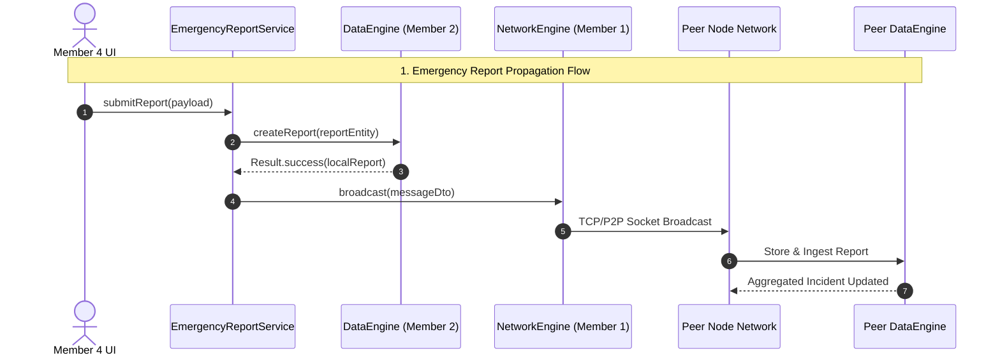

# BLACKOUT — Team Implementation Tracker & Handoff Document

> **Document Type:** Team Handoff & Technical Work-In-Progress Tracker  
> **Target Audience:** BLACKOUT Core Development Team (Members 1, 2, 3, 4)  
> **Status Date:** October 2026  
> **Repository Authority:** This document reflects the true status of the code in the repository relative to official architectural specifications. Where specs and repository code differ, explicit mismatches are documented.

---

## Executive Summary & System Overview

The **BLACKOUT** emergency mesh communication system is organized into **four primary domain modules**, each owned by a specific team member:

```
┌─────────────────────────────────────────────────────────────────────────┐
│                    Member 4: Application & AI UI                        │
│    (React Native App Shell, Design System, Screen Flow, Adapters)       │
└──────────────┬──────────────────────────┬───────────────────────────────┘
               │                          │
               ▼                          ▼
┌──────────────────────────────┐ ┌────────────────────────────────────────┐
│ Member 2: Data & Intelligence│ │      Member 3: Geospatial Engine      │
│(Room/SQLite, Incident Logic, │ │ (GNSS Location, Offline MapLibre/MBTiles│
│ Aggregation, Local Storage)  │ │      Hazard Routing, A* Router)        │
└──────────────┬───────────────┘ └───────────────────┬────────────────────┘
               │                                     │
               └──────────────────┬──────────────────┘
                                  │
                                  ▼
┌─────────────────────────────────────────────────────────────────────────┐
│                       Member 1: Network Engine                          │
│   (Android Native P2P, Wi-Fi Direct, TCP Transport, Forwarding/Relay)   │
└─────────────────────────────────────────────────────────────────────────┘
```

---

## Status Legend

- **`[COMPLETE]`** — Implemented, fully wired, tested, and operational.
- **`[IN PROGRESS]`** — Active development underway with substantial baseline logic present.
- **`[PARTIAL]`** — Baseline classes or interfaces exist, but key functions or internal logic are missing.
- **`[NEEDS INTEGRATION]`** — Implementation exists in native code (Java/Android) or TS, but native-to-TS bridge exposure or cross-module wiring is missing.
- **`[NOT STARTED]`** — Required by specs, but zero implementation currently exists in the repository.
- **`[BLOCKED]`** — Work cannot proceed until an upstream dependency/bridge is exposed.

---

## Member 1 — Network Engine

### A. Responsibility
Member 1 owns all low-level offline networking:
- Native Android P2P mesh discovery and transports (Wi-Fi Direct, Bluetooth LE, TCP Sockets).
- Peer discovery, peer connection lifecycle, handshake, and capability exchange.
- Message framing, envelope creation, binary/JSON serialization (`MessageDto`).
- Store-and-Forward routing, message deduplication, TTL decrement, hop count tracking, flooding/gossip propagation.
- Outbound message queueing, delivery state acknowledgments (ACKs), and retries with backoff.
- Native bridge exposure of network events and messaging functions to React Native.

### B. Already Implemented
- **Message Model & Serializer**:
  - [`MessageDto.java`](file:///C:/Users/rajpu/Desktop/BLACKOUT/android/app/src/main/java/com/blackout/network/MessageDto.java): Fully defined message structure containing `message_id`, `sender_id`, `recipient_id`, `type`, `payload`, `timestamp`, `ttl`, `hop_count`, `priority`, `payload_hash`, `signature`.
  - [`MessageSerializer.java`](file:///C:/Users/rajpu/Desktop/BLACKOUT/android/app/src/main/java/com/blackout/network/MessageSerializer.java): Standard JSON serialization/deserialization with string framing and null-safety.
- **Socket Transport & Connection Management**:
  - [`AndroidNetworkEngine.java`](file:///C:/Users/rajpu/Desktop/BLACKOUT/android/app/src/main/java/com/blackout/network/AndroidNetworkEngine.java): Entry point for engine start/stop, socket initialization, sending messages, and registering packet listeners.
  - [`ConnectionManager.java`](file:///C:/Users/rajpu/Desktop/BLACKOUT/android/app/src/main/java/com/blackout/network/ConnectionManager.java): Manages active TCP client socket connections and peer IP addresses.
  - [`OutgoingSendManager.java`](file:///C:/Users/rajpu/Desktop/BLACKOUT/android/app/src/main/java/com/blackout/network/OutgoingSendManager.java): Background worker thread for consuming non-blocking outbound socket send queues.
- **React Native Bridge Base (Partial)**:
  - [`BlackoutNativeModule.java`](file:///C:/Users/rajpu/Desktop/BLACKOUT/android/app/src/main/java/com/blackout/BlackoutNativeModule.java): Java native module exposing `sendMessage(ReadableMap)` and `pingNative()`.

### C. Partially Implemented
- **Peer Discovery & Lifecycle**: `ConnectionManager.java` manages connected IP targets, but physical Wi-Fi Direct (`WifiP2pManager`) and Bluetooth LE discovery loops are stubbed or mock-based. Automatic neighbor discovery and dynamic connection creation are incomplete.
- **Deduplication & Relay Logic**: Store-and-Forward routing rules (checking `seen_message_ids`, decrementing `ttl`, incrementing `hop_count`) exist in raw Java methods, but are not wired into an active background transport daemon loop.
- **Native Event Emitter Exposure**: `BlackoutNativeModule.java` receives incoming TCP packets, but does not emit `PEER_CONNECTED`, `PEER_DISCONNECTED`, or `MESSAGE_RECEIVED` events back to React Native via `DeviceEventManagerModule.RCTDeviceEventEmitter`.

### D. Remaining Work Checklist

| Task | Why Needed | Existing File/Interface | Expected Result | Dependencies | Suggested Verification |
| :--- | :--- | :--- | :--- | :--- | :--- |
| **1. Dynamic Wi-Fi Direct Peer Discovery** | Discover nearby devices without cellular/Wi-Fi APs | [`AndroidNetworkEngine.java`](file:///C:/Users/rajpu/Desktop/BLACKOUT/android/app/src/main/java/com/blackout/network/AndroidNetworkEngine.java) | Auto-discovers and connects to nearby BLACKOUT nodes | Android Wi-Fi Direct API | Run on 2 physical Android phones; confirm auto P2P link |
| **2. Native Bridge Network Event Emission** | Inform React Native of incoming messages and peer changes | [`BlackoutNativeModule.java`](file:///C:/Users/rajpu/Desktop/BLACKOUT/android/app/src/main/java/com/blackout/BlackoutNativeModule.java) | Emits `MESSAGE_RECEIVED` and `PEER_LIST_UPDATED` events | `DeviceEventManagerModule` | Send message from Node A; verify TS `NativeBridgeAdapter` receives event on Node B |
| **3. Store-and-Forward Mesh Relay** | Propagate messages beyond 1-hop physical range | [`AndroidNetworkEngine.java`](file:///C:/Users/rajpu/Desktop/BLACKOUT/android/app/src/main/java/com/blackout/network/AndroidNetworkEngine.java) | Forwards un-seen messages with `ttl > 0` to all active peers except sender | Deduplication cache | Set up 3 nodes in line (A -> B -> C); verify A reaches C via B |
| **4. ACK & Retry Queue** | Guarantee message delivery in lossy P2P environments | [`OutgoingSendManager.java`](file:///C:/Users/rajpu/Desktop/BLACKOUT/android/app/src/main/java/com/blackout/network/OutgoingSendManager.java) | Retries unacknowledged DIRECT messages up to max retries | Storage / Outbound Queue | Disconnect node during send; verify retry on reconnect |

### E. Acceptance Criteria
Member 1 module completion requires:
1. Two or more physical Android devices discover each other automatically over Wi-Fi Direct / Bluetooth LE without internet.
2. A `MessageDto` sent on Device A arrives at Device B, triggering a native event that reaches the React Native application layer.
3. Multihop forwarding correctly passes messages across 3+ physical devices, terminating when `ttl == 0` or duplicate `message_id` is detected.
4. Clean unit test coverage for `MessageSerializer` and packet deduplication.

---

## Member 2 — Data & Intelligence

### A. Responsibility
Member 2 owns all persistent offline data and intelligence processing:
- Room Database schema, migrations, DAOs, and concrete native repositories.
- Entities for `EmergencyReport`, `Incident`, `Evidence`, `Resource`, `Hazard`, and `NetworkMessage`.
- `DataEngine` concrete Java implementation and native bridge exposure to TypeScript.
- Deterministic incident aggregation, report clustering, and confidence score calculation algorithms.
- Evidence handling and media storage tracking.
- Outbound message queue persistence and delivery state tracking.

### B. Already Implemented
- **Room Persistence Infrastructure**:
  - [`BlackoutDatabase.java`](file:///C:/Users/rajpu/Desktop/BLACKOUT/android/app/src/main/java/com/blackout/data/BlackoutDatabase.java): Room database definition managing versioning and table entities.
  - **Entities**: [`ReportEntity.java`](file:///C:/Users/rajpu/Desktop/BLACKOUT/android/app/src/main/java/com/blackout/data/ReportEntity.java), [`IncidentEntity.java`](file:///C:/Users/rajpu/Desktop/BLACKOUT/android/app/src/main/java/com/blackout/data/IncidentEntity.java), [`ResourceEntity.java`](file:///C:/Users/rajpu/Desktop/BLACKOUT/android/app/src/main/java/com/blackout/data/ResourceEntity.java), [`HazardEntity.java`](file:///C:/Users/rajpu/Desktop/BLACKOUT/android/app/src/main/java/com/blackout/data/HazardEntity.java), [`MessageQueueEntity.java`](file:///C:/Users/rajpu/Desktop/BLACKOUT/android/app/src/main/java/com/blackout/data/MessageQueueEntity.java).
  - **DAOs**: [`ReportDao.java`](file:///C:/Users/rajpu/Desktop/BLACKOUT/android/app/src/main/java/com/blackout/data/ReportDao.java), [`IncidentDao.java`](file:///C:/Users/rajpu/Desktop/BLACKOUT/android/app/src/main/java/com/blackout/data/IncidentDao.java), [`ResourceDao.java`](file:///C:/Users/rajpu/Desktop/BLACKOUT/android/app/src/main/java/com/blackout/data/ResourceDao.java), [`HazardDao.java`](file:///C:/Users/rajpu/Desktop/BLACKOUT/android/app/src/main/java/com/blackout/data/HazardDao.java).
  - **Concrete Engine Baseline**: [`RoomDataEngine.java`](file:///C:/Users/rajpu/Desktop/BLACKOUT/android/app/src/main/java/com/blackout/data/RoomDataEngine.java) implements database queries, report saving, and basic querying.

### C. Partially Implemented & Critical Discrepancies
> [!WARNING]
> **CRITICAL ARCHITECTURAL DISCREPANCY & INTEGRATION GAP**
> 
> **Documentation vs Repository Mismatch:**
> - **Spec Expectation:** Specs state that `DataEngineAdapter.ts` consumes native DataEngine methods exposed over the React Native bridge.
> - **Repository State:** [`BlackoutNativeModule.java`](file:///C:/Users/rajpu/Desktop/BLACKOUT/android/app/src/main/java/com/blackout/BlackoutNativeModule.java) **DOES NOT EXPOSE ANY DATA ENGINE METHODS** to React Native (`saveReport`, `getReports`, `getIncidents`, etc. are entirely missing from `BlackoutNativeModule.java`).
> - **TypeScript Workaround:** [`DataEngineAdapter.ts`](file:///C:/Users/rajpu/Desktop/BLACKOUT/src/adapters/DataEngineAdapter.ts) currently maintains an **in-memory fallback mock Map** to allow Member 4 UI work to proceed without crashing.
> 
> **Status:** `[BLOCKED / NEEDS INTEGRATION]` — Room database exists natively in Java, but is unreachable from React Native!

- **Incident Aggregation & Confidence Scoring**: `IncidentDao` and `ReportDao` exist, but the deterministic multi-report clustering algorithm (spatial-temporal grouping + confidence calculation) is incomplete in Java.

### D. Remaining Work Checklist

| Task | Why Needed | Existing File/Interface | Expected Result | Dependencies | Suggested Verification |
| :--- | :--- | :--- | :--- | :--- | :--- |
| **1. Expose DataEngine in Native Bridge** | `[BLOCKING]` Allow React Native app to read/write persistent Room database | [`BlackoutNativeModule.java`](file:///C:/Users/rajpu/Desktop/BLACKOUT/android/app/src/main/java/com/blackout/BlackoutNativeModule.java) | Exposes `createReport`, `getReports`, `getIncidents`, `getResources` bridge methods | `RoomDataEngine.java` | Call `DataEngineAdapter.createReport()` in TS; verify record written to SQLite database |
| **2. Deterministic Incident Clustering** | Automatically aggregate overlapping emergency reports into distinct Incidents | [`RoomDataEngine.java`](file:///C:/Users/rajpu/Desktop/BLACKOUT/android/app/src/main/java/com/blackout/data/RoomDataEngine.java) | Merges reports within 500m & 30 mins into single Incident with updated confidence score | `ReportDao`, `IncidentDao` | Insert 3 reports for same location; confirm 1 aggregated Incident is generated |
| **3. Wire DataEngineAdapter to Native** | Replace in-memory mock storage in TS with actual native bridge calls | [`DataEngineAdapter.ts`](file:///C:/Users/rajpu/Desktop/BLACKOUT/src/adapters/DataEngineAdapter.ts) | TypeScript adapter forwards calls to `BlackoutNativeModule` | Bridge methods exposed | Save report in UI; verify persistence survives app restart |
| **4. Database Migrations & Schemas** | Support app schema updates without data corruption | [`BlackoutDatabase.java`](file:///C:/Users/rajpu/Desktop/BLACKOUT/android/app/src/main/java/com/blackout/data/BlackoutDatabase.java) | Migration strategy defined for Room database | Room API | Increment database version; test upgrade path |

### E. Acceptance Criteria
Member 2 module completion requires:
1. `DataEngineAdapter.ts` completely removes in-memory mock storage and successfully reads/writes to Room SQLite database via `BlackoutNativeModule`.
2. Saving a report persists to disk and survives full Android application restart / process kill.
3. Multiple incoming emergency reports for the same area dynamically aggregate into a clustered `Incident` with a deterministic confidence score.
4. Outbound queue persists messages across app restarts until ACKed.

---

## Member 3 — Geospatial Engine

### A. Responsibility
Member 3 owns all location, mapping, and hazard-aware routing capabilities:
- Native GNSS / GPS location acquisition and subscriber stream (`LocationDto`).
- Offline MBTiles vector map rendering integration boundary (MapLibre).
- Offline spatial querying and hazard database retrieval.
- Offline hazard-aware routing engine ($A^*$ / Dijkstra algorithm).
- Dynamic route calculation with `NO_SAFE_ROUTE` fallback when hazards block all paths.
- Native bridge exposure of location streams and routing engines to TypeScript (`GeoEngineAdapter`).

### B. Already Implemented
- **Native Routing & Geo Infrastructure**:
  - [`OfflineGeoEngine.java`](file:///C:/Users/rajpu/Desktop/BLACKOUT/android/app/src/main/java/com/blackout/geo/OfflineGeoEngine.java): Native Java entry point for location updates, hazard loading, and route computation.
  - [`AStarRouter.java`](file:///C:/Users/rajpu/Desktop/BLACKOUT/android/app/src/main/java/com/blackout/geo/AStarRouter.java): Graph-based pathfinding implementation supporting hazard cost penalties.
  - [`HazardProjector.java`](file:///C:/Users/rajpu/Desktop/BLACKOUT/android/app/src/main/java/com/blackout/geo/HazardProjector.java): Spatial math utility for projecting point/polygon hazard zones onto road network edges.
  - [`OfflineMapManager.java`](file:///C:/Users/rajpu/Desktop/BLACKOUT/android/app/src/main/java/com/blackout/geo/OfflineMapManager.java): MBTiles offline tile archive reader and spatial query provider.

### C. Partially Implemented & Critical Discrepancies
> [!WARNING]
> **CRITICAL ARCHITECTURAL DISCREPANCY & INTEGRATION GAP**
> 
> **Documentation vs Repository Mismatch:**
> - **Spec Expectation:** Specs state that `GeoEngineAdapter.ts` streams real-time GNSS location and computes hazard-aware routes via native `OfflineGeoEngine`.
> - **Repository State:** [`BlackoutNativeModule.java`](file:///C:/Users/rajpu/Desktop/BLACKOUT/android/app/src/main/java/com/blackout/BlackoutNativeModule.java) **DOES NOT EXPOSE ANY GEO ENGINE METHODS OR LOCATION EMITTERS** to React Native (`getCurrentLocation`, `calculateRoute`, `startLocationUpdates` are completely missing from `BlackoutNativeModule.java`).
> - **TypeScript Workaround:** [`GeoEngineAdapter.ts`](file:///C:/Users/rajpu/Desktop/BLACKOUT/src/adapters/GeoEngineAdapter.ts) currently uses **mock static fallback coordinates** (e.g., standard fallback lat/lng) and fallback straight-line route calculations.
> 
> **Status:** `[BLOCKED / NEEDS INTEGRATION]` — Native $A^*$ router and MBTiles manager exist in Java, but are completely disconnected from the React Native application!

### D. Pending — React Native Geo Bridge

> [!WARNING]
> **Status:** `BLOCKED / WAITING FOR MEMBER 3`  
> The native Geo engine implementation (`OfflineGeoEngine.java`, `AStarRouter.java`) is complete and compiled, but the React Native bridge (`BlackoutGeoModule.java`) is not currently available.

**Pending work for Member 3:**
- Create `BlackoutGeoModule.java` in `android/app/src/main/java/com/blackout/bridge/`
- Register `BlackoutGeoModule` in `BlackoutPackage.java`
- Expose `OfflineGeoEngine` methods to React Native:
  - `getCurrentLocation()`
  - location update start/stop for `observeLocation()`
  - `loadOfflineMap()`
  - `getHazards()`
  - `addHazard()`
  - `calculateRoute()`
  - `calculateDistance()`
  - `findNearby()`
- Emit `LOCATION_UPDATED` native events via `DeviceEventManagerModule.RCTDeviceEventEmitter`
- Normalize native Java ↔ React Native JSON fields according to the documented GeoEngine DTO contracts (`accuracy_m`, `captured_at`, `hazard_id`, `source_incident_id`, `distance_m`, `duration_s`, etc.)
- Verify physical-device GNSS / native Geo integration

**Member 4 dependency after bridge completion:**
- Create/use `NativeGeoEngineAdapter.ts`
- Wire the real `GeoEngine` into `RootNavigator.tsx`
- Replace `DevGeoEngine` on Android production path
- Verify `MapScreen` uses real Geo data

### E. Remaining Work Checklist

| Task | Why Needed | Existing File/Interface | Expected Result | Dependencies | Suggested Verification |
| :--- | :--- | :--- | :--- | :--- | :--- |
| **1. Expose GeoEngine in Native Bridge** | `[BLOCKING]` Allow React Native to request location and calculate routes | [`BlackoutNativeModule.java`](file:///C:/Users/rajpu/Desktop/BLACKOUT/android/app/src/main/java/com/blackout/BlackoutNativeModule.java) | Exposes `getCurrentLocation`, `calculateRoute`, `startLocationUpdates` | [`OfflineGeoEngine.java`](file:///C:/Users/rajpu/Desktop/BLACKOUT/android/app/src/main/java/com/blackout/geo/OfflineGeoEngine.java) | Call `GeoEngineAdapter.calculateRoute()` in TS; receive native $A^*$ route payload |
| **2. Native GNSS Emitter** | Stream real-time location changes to React Native UI | [`BlackoutNativeModule.java`](file:///C:/Users/rajpu/Desktop/BLACKOUT/android/app/src/main/java/com/blackout/BlackoutNativeModule.java) | Emits `LOCATION_UPDATED` events when device moves | `FusedLocationProviderClient` | Move physical device; observe map marker updates |
| **3. Wire GeoEngineAdapter to Native** | Replace TS fallback coordinates with native location stream | [`GeoEngineAdapter.ts`](file:///C:/Users/rajpu/Desktop/BLACKOUT/src/adapters/GeoEngineAdapter.ts) | Calls native bridge for real GPS fixes | Bridge methods exposed | Verify GPS location accuracy on physical device without cellular |
| **4. MapLibre MBTiles Integration** | Render vector maps offline on MapScreen | [`MapScreen.tsx`](file:///C:/Users/rajpu/Desktop/BLACKOUT/src/screens/MapScreen.tsx) | Displays offline MBTiles map canvas with hazard overlays | MapLibre SDK / OfflineMapManager | Disconnect internet; open map; confirm map tiles render from local disk |

### F. Acceptance Criteria
Member 3 module completion requires:
1. `GeoEngineAdapter.ts` receives real GNSS location updates from native Android location services without internet.
2. `calculateRoute()` returns an $A^*$ computed path that dynamically detours around active hazard zones saved in `RoomDataEngine`.
3. If hazards block all possible paths, the engine returns `NO_SAFE_ROUTE` status with an explanation payload.
4. Offline MBTiles map renders smoothly in the MapScreen UI without external tile server requests.

---

## Member 4 — Application & AI

### A. Responsibility
Member 4 owns the React Native frontend application:
- Application design system, dark mode theme tokens, and typography.
- App shell, root navigation container, and screen transitions.
- All application screens: Home, Map, Emergency Report, Alerts, Profile, Settings, Incident Details, Resource Directory, Peer List, Direct Messaging.
- Application state management, hooks (`useEmergencyReport`, `useLocation`, etc.), and orchestration services (`EmergencyReportService`).
- TypeScript contracts and integration adapters (`DataEngineAdapter`, `GeoEngineAdapter`, `NetworkEngineAdapter`, `NativeBridgeAdapter`).
- AI UI integration (ONNX local model interface for report categorization / priority assistance).

### B. Already Implemented (Current Workspace Audit)
- **Design System & Theme**:
  - [`theme.ts`](file:///C:/Users/rajpu/Desktop/BLACKOUT/src/theme/theme.ts): Dark mode color palette, typography scales, spacing tokens, glassmorphism styles, and alert severity colors.
- **App Shell & Core Navigation**:
  - [`App.tsx`](file:///C:/Users/rajpu/Desktop/BLACKOUT/App.tsx): Root layout wrapper with SafeAreaProvider and custom navigation container.
  - [`RootNavigator.tsx`](file:///C:/Users/rajpu/Desktop/BLACKOUT/src/navigation/RootNavigator.tsx): Custom state-driven tab & stack navigation bar.
- **Screens**:
  - [`HomeScreen.tsx`](file:///C:/Users/rajpu/Desktop/BLACKOUT/src/screens/HomeScreen.tsx): Main dashboard with quick action cards, active alerts summary, network mesh status pill, and navigation links.
  - [`EmergencyReportScreen.tsx`](file:///C:/Users/rajpu/Desktop/BLACKOUT/src/screens/EmergencyReportScreen.tsx): Full-featured emergency report submission screen with form state, category selector, severity picker, description, location attachment indicator, and error banners.
  - [`AlertsScreen.tsx`](file:///C:/Users/rajpu/Desktop/BLACKOUT/src/screens/AlertsScreen.tsx): Active emergency alerts list with filter pills and detail views.
  - [`MapScreen.tsx`](file:///C:/Users/rajpu/Desktop/BLACKOUT/src/screens/MapScreen.tsx): Interactive map canvas shell with hazard overlays and route controls.
  - [`ProfileScreen.tsx`](file:///C:/Users/rajpu/Desktop/BLACKOUT/src/screens/ProfileScreen.tsx): Mesh node identity, public key fingerprint, and peer node settings.
  - [`SettingsScreen.tsx`](file:///C:/Users/rajpu/Desktop/BLACKOUT/src/screens/SettingsScreen.tsx): App configuration, storage stats, and debug logs.
- **Service & Hooks Architecture (Phases 3–7 Implemented)**:
  - [`EmergencyReportService.ts`](file:///C:/Users/rajpu/Desktop/BLACKOUT/src/services/EmergencyReportService.ts): Business logic orchestrator for local report persistence and network broadcast.
  - [`useEmergencyReport.ts`](file:///C:/Users/rajpu/Desktop/BLACKOUT/src/hooks/useEmergencyReport.ts): Form state management and UI lifecycle hook.
  - [`RuleBasedAIEngine.ts`](file:///C:/Users/rajpu/Desktop/BLACKOUT/src/services/RuleBasedAIEngine.ts): Deterministic offline heuristic engine implementing `AIEngine` for real-time advisory report category and severity suggestions.
  - [`MapService.ts`](file:///C:/Users/rajpu/Desktop/BLACKOUT/src/services/MapService.ts), [`IncidentService.ts`](file:///C:/Users/rajpu/Desktop/BLACKOUT/src/services/IncidentService.ts), [`ResourceService.ts`](file:///C:/Users/rajpu/Desktop/BLACKOUT/src/services/ResourceService.ts).
- **TypeScript Adapters & Contracts (Phases 6A & 7A Implemented)**:
  - [`RoomDataEngineAdapter.ts`](file:///C:/Users/rajpu/Desktop/BLACKOUT/src/adapters/data/RoomDataEngineAdapter.ts): Connects TS `DataEngine` contract directly to native Android Room SQLite database via `BlackoutDataModule`.
  - [`NativeNetworkEngineAdapter.ts`](file:///C:/Users/rajpu/Desktop/BLACKOUT/src/adapters/network/NativeNetworkEngineAdapter.ts): Connects TS `NetworkEngine` contract directly to native `BlackoutNativeModule` P2P TCP engine (listening on Port 18888).
  - [`DevGeoEngine.ts`](file:///C:/Users/rajpu/Desktop/BLACKOUT/src/adapters/geo/DevGeoEngine.ts): Development fallback for GeoEngine contract while Member 3 native Geo bridge is pending.

### C. Completed Member 4 Phases
- **Phase 1 — Application Shell & Navigation ✅**
- **Phase 2 — Home Command Center ✅**
- **Phase 3 — Emergency Reporting Flow ✅**
- **Phase 4 — Incident List & Detail UI ✅**
- **Phase 5 — Resource Directory & Add Resource UI ✅**
- **Phase 6 — Offline Map Canvas & Selected Marker Overlays ✅**
- **Phase 6A — Real Room Data Engine Integration ✅**
- **Phase 7A — Native Network Engine Integration ✅**
- **Phase 7B — Offline Smart AI Classifier & Evidence UI ✅**
- **Phase 8A — Direct People & Messaging UI (Peers, Conversations, Direct Message) ✅**
- **Phase 9 — Application Composition Root / ServiceProvider ✅**

### D. Remaining Work Checklist

| Task | Why Needed | Existing File/Interface | Expected Result | Dependencies | Suggested Verification |
| :--- | :--- | :--- | :--- | :--- | :--- |
| **1. Connect Native Geo Adapter** | Replace `DevGeoEngine` with native location stream | `src/adapters/geo/NativeGeoEngineAdapter.ts` | Calls native `BlackoutGeoModule` for GNSS fixes & $A^*$ routing | Member 3 `BlackoutGeoModule` bridge | Open map on phone; verify native GPS fix |

### E. Acceptance Criteria
Member 4 module completion requires:
1. Complete UI screen flow (Home -> Report -> Submission Confirmation -> Alert List -> Map View -> Resources -> Direct Chat) operates seamlessly without crashes.
2. Form submission correctly delegates through `EmergencyReportService`, saving to Room SQLite database and broadcasting over native P2P network sockets.
3. UI gracefully displays empty, loading, error, and offline states without raw exception popups.
4. Clean `tsc` compilation with zero TypeScript errors or broken contract imports.

---

## Cross-Member Integration Architecture

Member 4 application components MUST ONLY consume backend capabilities through defined TypeScript contracts and adapters. Direct access to native Java classes or Room database instances is prohibited.

```
┌────────────────────────────────────────────────────────────────────────┐
│                      Member 4 Application UI                           │
└──────────────────────────────────┬─────────────────────────────────────┘
                                   │
                                   ▼
┌────────────────────────────────────────────────────────────────────────┐
│                        TypeScript Adapters                             │
│   (DataEngineAdapter, GeoEngineAdapter, NetworkEngineAdapter)          │
└──────────────────────────────────┬─────────────────────────────────────┘
                                   │  (React Native Bridge Call)
                                   ▼
┌────────────────────────────────────────────────────────────────────────┐
│                     BlackoutNativeModule.java                          │
└──────────────┬───────────────────┬───────────────────┬─────────────────┘
               │                   │                   │
               ▼                   ▼                   ▼
┌───────────────────────┐ ┌─────────────────┐ ┌──────────────────────────┐
│  RoomDataEngine.java  │ │OfflineGeoEngine │ │AndroidNetworkEngine.java │
│      (Member 2)       │ │   (Member 3)    │ │        (Member 1)        │
└───────────────────────┘ └─────────────────┘ └──────────────────────────┘
```

---

## Critical Integration Gaps Matrix

> [!IMPORTANT]
> The table below summarizes the exact blocking gaps identified by auditing the repository against system specs. 

| Integration Gap | Owner | Current State | Required Work | Blocking? | Upstream Dependency |
| :--- | :--- | :--- | :--- | :--- | :--- |
| **DataEngine Bridge Methods Missing** | Member 2 | `RoomDataEngine.java` exists, but `BlackoutNativeModule.java` has 0 Data Engine methods. `DataEngineAdapter.ts` uses mock map. | Expose Room DB CRUD operations in `BlackoutNativeModule.java`. Wire `DataEngineAdapter.ts` to bridge. | **YES** | `RoomDataEngine.java` |
| **GeoEngine Bridge Methods Missing** | Member 3 | `OfflineGeoEngine.java` exists, but `BlackoutNativeModule.java` has 0 Geo methods. `GeoEngineAdapter.ts` uses static fallback coordinates. | Expose GNSS location streams and $A^*$ routing in `BlackoutNativeModule.java`. Wire `GeoEngineAdapter.ts` to bridge. | **YES** | `OfflineGeoEngine.java` |
| **Network Event Listener Exposure** | Member 1 | `BlackoutNativeModule.java` handles `sendMessage`, but does not emit `PEER_CONNECTED` or `MESSAGE_RECEIVED` events to JS. | Add `RCTDeviceEventEmitter` calls in `BlackoutNativeModule.java` on TCP packet receipt. | **YES** | `AndroidNetworkEngine.java` |
| **App Composition Root / Service Container** | Member 4 | Services construct adapters manually. | Create a `ServiceProvider` context in React Native for dependency injection. | No | TS Adapters |
| **Local Device Location Permission Flow** | Members 3 & 4 | Location hooks assume permissions granted. | Add standard Android `ACCESS_FINE_LOCATION` runtime permission request flow. | No | Native Android Manifest |

---

## End-to-End User Flows

The complete BLACKOUT system relies on 5 critical end-to-end user flows that span across multiple members:



### 1. Emergency Report Submission & Mesh Propagation
1. **User Action (Member 4 UI)**: Fills out report in `EmergencyReportScreen` and taps "Submit Report".
2. **Local Storage (Member 2 DataEngine)**: `EmergencyReportService` passes payload to `DataEngineAdapter`. `RoomDataEngine` persists report into SQLite disk storage as `ReportEntity`.
3. **Local Result**: UI updates immediately to reflect local storage success (`LOCAL_SAVED`).
4. **Mesh Broadcast (Member 1 NetworkEngine)**: Service constructs `MessageDto` (type `REPORT`) and calls `NetworkEngineAdapter.broadcast()`. Native network engine queues packet and sends across active TCP socket connections to neighbor peers.
5. **Peer Ingestion**: Receiving node's `NetworkEngine` receives packet, checks duplicate hash cache, emits native event to `DataEngine`, which saves report and updates incident aggregation.

### 2. GNSS Location Acquisition Flow
1. **Subscriber (Member 4 UI)**: Component mounts map or report screen and subscribes to location changes.
2. **Geo Engine Stream (Member 3 GeoEngine)**: Native `OfflineGeoEngine` reads `FusedLocationProviderClient` updates.
3. **Bridge Emission**: `BlackoutNativeModule` emits `LOCATION_UPDATED` event across bridge to `GeoEngineAdapter.ts`.
4. **UI Render**: Map marker updates to current latitude/longitude.

### 3. Hazard-Aware Routing Flow
1. **Route Request (Member 4 Map UI)**: User selects destination coordinate on `MapScreen`.
2. **Geo Engine Computation (Member 3 GeoEngine)**: `GeoEngineAdapter.calculateRoute(origin, destination)` calls native `OfflineGeoEngine`.
3. **Hazard Overlay Query**: `OfflineGeoEngine` queries `RoomDataEngine` (Member 2) for active hazards along candidate path edges.
4. **$A^*$ Execution**: `AStarRouter.java` computes path, adding high traversal cost penalties to hazard edges.
5. **Result Payload**: Returns polyline route DTO to UI, or `NO_SAFE_ROUTE` if all paths are blocked by lethal hazards.

### 4. Incident Clustering & Confidence Aggregation
1. **Multi-Report Reception**: Node receives 5 separate emergency reports for "Structure Fire" at same intersection within 15 minutes.
2. **Aggregation Daemon (Member 2 DataEngine)**: `RoomDataEngine` runs spatial-temporal clustering algorithm.
3. **Incident Generation**: Merges 5 reports into single `Incident` entity, calculating confidence score (e.g., $0.92$ based on source diversity & report count).
4. **UI Update**: `AlertsScreen` displays 1 high-confidence Incident card instead of 5 noisy duplicate reports.

### 5. Direct Node-to-Node Messaging Flow
1. **User Action (Member 4 UI)**: Selects a peer node from `PeersScreen` and types direct text message.
2. **Direct Frame Construction**: App constructs `MessageDto` with `recipient_id = target_node_id`.
3. **Network Transport (Member 1 NetworkEngine)**: `ConnectionManager` looks up target peer's IP address and transmits directly over TCP socket.
4. **ACK Receipt**: Target node sends `ACK` message back; sender UI updates message delivery status indicator to "Delivered".

---

## Definition of Done (Project Master Benchmark)

The entire BLACKOUT project is considered **COMPLETE** only when all of the following criteria are empirically verified:

### 1. Build Verification
- [ ] Clean TypeScript compilation: `npx tsc --noEmit` returns zero errors.
- [ ] Clean Android release build: `./gradlew assembleRelease` compiles without warnings or missing native symbol errors.

### 2. Unit & Module Tests
- [ ] **Network Engine**: Packet framing, serialization, deduplication, and TTL decrement unit tests pass.
- [ ] **Data Engine**: Room database migrations, DAO CRUD operations, and incident clustering unit tests pass.
- [ ] **Geo Engine**: $A^*$ pathfinding, hazard cost calculation, and polygon intersection unit tests pass.
- [ ] **Application & Services**: `EmergencyReportService` unit tests pass with mocked adapters.

### 3. Physical Android Device Verification
- [ ] **Multi-Device Mesh Test**: Minimum 3 physical Android smartphones running BLACKOUT with airplane mode enabled (no cellular data, no SIM, no internet Wi-Fi).
- [ ] **P2P Discovery**: Devices auto-discover each other via Wi-Fi Direct / Bluetooth LE within 30 seconds of app launch.
- [ ] **Store-and-Forward Propagation**: Emergency report submitted on Phone A propagates through Phone B to reach Phone C (out of direct range of A).
- [ ] **Offline Map Rendering**: `MapScreen` renders vector tiles from local MBTiles file without downloading data.

### 4. Failure & Resilience Verification
- [ ] **Network Disconnection**: App queues outbound reports when no peers are connected, automatically transmitting them upon peer reconnection.
- [ ] **Location Unavailable**: App gracefully displays fallback manual location selection when GNSS signal is lost (e.g., indoors/underground).
- [ ] **Malformed Packets**: Network engine safely drops invalid or tampered `MessageDto` payloads without crashing app process.
- [ ] **Database Persistence**: Force-killing app process immediately after report creation retains report intact upon app restart.

---

## Recommended Team Execution Order

Tasks MUST be executed according to backend-to-frontend dependency ordering:

```
┌────────────────────────────────────────────────────────────────────────┐
│ Phase 1: Native Bridge & Engine Core Unlocking (Members 1, 2, 3)       │
│  - Expose RoomDataEngine methods in BlackoutNativeModule.java           │
│  - Expose OfflineGeoEngine & GNSS location in BlackoutNativeModule.java│
│  - Implement NativeBridgeAdapter RCTDeviceEventEmitter events          │
└──────────────────────────────────┬─────────────────────────────────────┘
                                   │
                                   ▼
┌────────────────────────────────────────────────────────────────────────┐
│ Phase 2: TS Adapter Integration & Service Wiring (Member 4 & All)      │
│  - Replace TS adapter mock maps with real NativeBridge calls           │
│  - Wire Phase 3 Step 4 HomeScreen -> EmergencyReportScreen navigation   │
│  - Create Application Composition Root / Service Container             │
└──────────────────────────────────┬─────────────────────────────────────┘
                                   │
                                   ▼
┌────────────────────────────────────────────────────────────────────────┐
│ Phase 3: Advanced Engines & UI Screens (Members 1, 2, 3, 4)            │
│  - Member 1: Complete store-and-forward mesh relay & ACK queues        │
│  - Member 2: Implement deterministic incident clustering algorithm     │
│  - Member 3: Integrate MapLibre MBTiles vector rendering on MapScreen  │
│  - Member 4: Build PeersScreen, Direct Messaging, and Resource Detail   │
└──────────────────────────────────┬─────────────────────────────────────┘
                                   │
                                   ▼
┌────────────────────────────────────────────────────────────────────────┐
│ Phase 4: E2E Integration, Physical Device Testing & Hardening          │
│  - Conduct multi-device offline P2P propagation verification           │
│  - Perform failure mode testing (peer dropouts, missing GPS)           │
│  - Final release build compilation and demo preparation                │
└────────────────────────────────────────────────────────────────────────┘
```

---
*End of BLACKOUT Team Implementation Tracker & Handoff Document*
